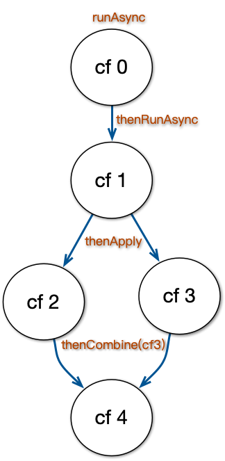

# <div align="center"><a href="#dummy"></a></div>

> 🚧 项目还在开发中，发布了`v0.x`版本： [](https://central.sonatype.com/artifact/io.foldright/cffu/0.8.3/versions)
>
> 工作项列表及其进展，参见 [issue 6](https://github.com/foldright/cffu/issues/6)。

----------------------------------------

<p align="center">
<a href="https://github.com/foldright/cffu/actions/workflows/fast_ci.yaml"></a>
<a href="https://github.com/foldright/cffu/actions/workflows/ci.yaml"></a>
<a href="https://app.codecov.io/gh/foldright/cffu/tree/main"></a>
<a href="https://openjdk.java.net/"></a>
<a href="https://kotlinlang.org"></a>
<a href="https://www.apache.org/licenses/LICENSE-2.0.html"></a>
<a href="https://foldright.io/cffu/apidocs/"></a>
<a href="https://central.sonatype.com/artifact/io.foldright/cffu/0.8.3/versions"></a>
<a href="https://github.com/foldright/cffu/releases"></a>
<a href="https://github.com/foldright/cffu/stargazers"></a>
<a href="https://github.com/foldright/cffu/fork"></a>
<a href="https://github.com/foldright/cffu/issues"></a>
<a href="https://github.com/foldright/cffu/graphs/contributors"></a>
<a href="https://github.com/foldright/cffu"></a>
<a href="https://gitpod.io/#https://github.com/foldright/cffu"></a>
</p>

<a href="#dummy"></a>

如何管理并发执行是个复杂易错的问题，业界有大量的工具、框架可以采用。

> 并发工具、框架的广度了解，可以看看如《[七周七并发模型](https://book.douban.com/subject/26337939/)》、《[Java虚拟机并发编程](https://book.douban.com/subject/24533312/)》、《[Scala并发编程（第2版）](https://book.douban.com/subject/35448965/)》；更多关于并发主题的书籍参见[书单](https://www.douban.com/doulist/41916951/)。

其中[`CompletableFuture (CF)`](https://docs.oracle.com/en/java/javase/19/docs/api/java.base/java/util/concurrent/CompletableFuture.html)有其优点：

- **`Java`标准库内置**
  - 无需额外依赖，几乎总是可用
  - 相信有极高的实现质量
- **广为人知广泛使用，有一流的群众基础**
  - `CompletableFuture`在2014年发布的`Java 8`提供，有～10年了
  - `CompletableFuture`的父接口[`Future`](https://docs.oracle.com/en/java/javase/19/docs/api/java.base/java/util/concurrent/Future.html)早在2004年发布的`Java 5`中提供，有～20年了
  - 虽然`Future`接口不支持 执行结果的异步获取与并发执行逻辑的编排，但也让广大`Java`开发者熟悉了`Future`这个典型的概念与工具
- **功能强大、但不会非常庞大复杂**
  - 足以应对日常的业务需求开发
  - 其它的大型并发框架（比如[`Akka`](https://akka.io/)、[`RxJava`](https://github.com/ReactiveX/RxJava)）在使用上需要理解的内容要多很多
  - 当然基本的并发关注方面及其复杂性，与具体使用哪个工具无关，都是要理解与注意的
- **高层抽象**
  - 或说 以业务流程的形式表达技术的并发流程
  - 可以不使用繁琐易错的基础并发协调工具，如[`CountDownLatch`](https://docs.oracle.com/en/java/javase/19/docs/api/java.base/java/util/concurrent/CountDownLatch.html)、锁（[`Lock`](https://docs.oracle.com/en/java/javase/19/docs/api/java.base/java/util/concurrent/locks/package-summary.html)）、信号量（[`Semaphore`](https://docs.oracle.com/en/java/javase/19/docs/api/java.base/java/util/concurrent/Semaphore.html)）

和其它并发工具、框架一样，`CompletableFuture` 用于

- 并发执行业务逻辑，或说编排并发的处理流程/处理任务
- 利用多核并行处理
- 提升业务响应性

值得更深入了解和应用。 💕

--------------------------------------------------------------------------------

<!-- START doctoc generated TOC please keep comment here to allow auto update -->
<!-- DON'T EDIT THIS SECTION, INSTEAD RE-RUN doctoc TO UPDATE -->

- [🎯 〇、目标](#-%E3%80%87%E7%9B%AE%E6%A0%87)
- [📚 一、`CompletableFuture` Guide](#-%E4%B8%80completablefuture-guide)
  - [`CF`并发执行的描述及其用语](#cf%E5%B9%B6%E5%8F%91%E6%89%A7%E8%A1%8C%E7%9A%84%E6%8F%8F%E8%BF%B0%E5%8F%8A%E5%85%B6%E7%94%A8%E8%AF%AD)
  - [`CF`并发执行的关注方面](#cf%E5%B9%B6%E5%8F%91%E6%89%A7%E8%A1%8C%E7%9A%84%E5%85%B3%E6%B3%A8%E6%96%B9%E9%9D%A2)
    - [1. 输入输出](#1-%E8%BE%93%E5%85%A5%E8%BE%93%E5%87%BA)
    - [2. 调度](#2-%E8%B0%83%E5%BA%A6)
    - [3. 错误处理](#3-%E9%94%99%E8%AF%AF%E5%A4%84%E7%90%86)
    - [4. 任务执行的超时处理](#4-%E4%BB%BB%E5%8A%A1%E6%89%A7%E8%A1%8C%E7%9A%84%E8%B6%85%E6%97%B6%E5%A4%84%E7%90%86)
  - [`CF`的功能](#cf%E7%9A%84%E5%8A%9F%E8%83%BD)
    - [1. `CF`的创建](#1-cf%E7%9A%84%E5%88%9B%E5%BB%BA)
    - [2. `CF`的显式读写方法](#2-cf%E7%9A%84%E6%98%BE%E5%BC%8F%E8%AF%BB%E5%86%99%E6%96%B9%E6%B3%95)
    - [3. `CF`的流程编排](#3-cf%E7%9A%84%E6%B5%81%E7%A8%8B%E7%BC%96%E6%8E%92)
    - [4. 设计辅助方法](#4-%E8%AE%BE%E8%AE%A1%E8%BE%85%E5%8A%A9%E6%96%B9%E6%B3%95)
  - [`CF`的设计模式](#cf%E7%9A%84%E8%AE%BE%E8%AE%A1%E6%A8%A1%E5%BC%8F)
    - [使用`CF`异步执行与主逻辑并发以缩短`RT`](#%E4%BD%BF%E7%94%A8cf%E5%BC%82%E6%AD%A5%E6%89%A7%E8%A1%8C%E4%B8%8E%E4%B8%BB%E9%80%BB%E8%BE%91%E5%B9%B6%E5%8F%91%E4%BB%A5%E7%BC%A9%E7%9F%ADrt)
  - [`CF`的最佳实现与使用陷阱](#cf%E7%9A%84%E6%9C%80%E4%BD%B3%E5%AE%9E%E7%8E%B0%E4%B8%8E%E4%BD%BF%E7%94%A8%E9%99%B7%E9%98%B1)
    - [`CF`创建子`CF`（两个`CF`使用同一线程池），且阻塞等待子`CF`结果](#cf%E5%88%9B%E5%BB%BA%E5%AD%90cf%E4%B8%A4%E4%B8%AAcf%E4%BD%BF%E7%94%A8%E5%90%8C%E4%B8%80%E7%BA%BF%E7%A8%8B%E6%B1%A0%E4%B8%94%E9%98%BB%E5%A1%9E%E7%AD%89%E5%BE%85%E5%AD%90cf%E7%BB%93%E6%9E%9C)
- [📦 二、库功能](#-%E4%BA%8C%E5%BA%93%E5%8A%9F%E8%83%BD)
  - [`Cffu.java`](#cffujava)
  - [🔌 Java API Docs](#-java-api-docs)
  - [🍪依赖](#%E4%BE%9D%E8%B5%96)
- [👋 ∞、关于库名](#-%E2%88%9E%E5%85%B3%E4%BA%8E%E5%BA%93%E5%90%8D)

<!-- END doctoc generated TOC please keep comment here to allow auto update -->

--------------------------------------------------------------------------------

# 🎯 〇、目标

- 作为文档库：
  - 完备说明`CompletableFuture`的使用方式
  - 给出 最佳实践建议 与 使用陷阱注意
  - 期望在业务中，更有效安全地使用`CompletableFuture`
  - 这部分是主要目标
- 作为代码库：
  - 补齐在业务使用中`CompletableFuture`所缺失的功能
  - 期望在业务中，更方便自然地使用`CompletableFuture`
  - 这部分只是甜点目标

# 📚 一、`CompletableFuture` Guide

**_WIP..._**

> 为了阅读的简洁方便，后文`CompletableFuture`会简写成`CF`。

## `CF`并发执行的描述及其用语

<a href="#dummy"></a>

**_WIP..._**

基本概念与术语：

- 任务（`Task`）/计算（`Computation`）/执行（`Execution`）
  - 任务逻辑（`Task Logic`）/业务逻辑（`Biz Logic`）
- 状态（`State`）
  - 运行中（`Running`）
  - 取消（`Cancelled`）
  - 完成（`Completed`/`Done`）
    - 成功（`Success`/`Successful`）/正常完成（`Completed Normally`）/成功完成（`Completed Successfully`）
    - 失败（`Failed`/`Fail`）/异常完成（`Completed Exceptionally`）
- 业务流程（`Biz Flow`）、`CF`链（`Chain`）
  - 流程图（`Flow Graph`）、有向无环图/`DAG`
    - 为什么构建的`CF`链一定是`DAG`？
  - 流程编排（`Flow Choreography`）
- 前驱（`Predecessor`）/后继（`Successor`）
  - 上游任务/前驱任务/`Dependency Task`（我依赖的任务）
  - 下游任务/后继任务/`Dependent Task`（依赖我的任务）
- 状态变化、事件（`Event`）、触发（`Trigger`）

## `CF`并发执行的关注方面

`CF`任务执行/流程编排，即执行提交的代码逻辑/计算/任务，涉及下面4个方面：

- **任务的输入输出**
  - 即`CF`所关联任务的输入参数/返回结果（及其数据类型）
- **任务的调度，即在哪个线程来执行任务**。可以是
  - 在触发的线程中就地连续执行任务
  - 在指定`Executor`（的线程）中执行任务
- **任务的错误处理**（任务执行报错）
- **任务的超时处理**
  - 处理超时是并发的基础关注方面之一
  - 在实现上可以看成`CF`的使用方式
  - `Java 9`通过新增的`completeOnTimeout(...)/orTimeout(...)`方法提供了内置支持

> 本节『并发关注方面』会举例一些`CF`方法名，以说明`CF`方法的命名模式，可以先不用关心方法的具体功能。  
> 在下一节『`CF`的功能』会分类展开说明`CF`方法的功能。

### 1. 输入输出

对应下面4种情况：

- **无输入无返回（00）**
  - 对应`Runnable`接口（包含单个`run`方法）
- **无输入有返回（01）**
  - 对应[`Supplier<O>`](https://docs.oracle.com/en/java/javase/19/docs/api/java.base/java/util/function/Supplier.html)接口（包含单个`supply`方法）
- **有输入无返回（10）**
  - 对应[`Consumer<I>`]()接口（包含单个`accept`方法）
- **有输入有返回（11）**
  - 对应[`Function<I, O>`](https://docs.oracle.com/en/java/javase/19/docs/api/java.base/java/util/function/Function.html)接口（包含单个`apply`方法）

注：

- 对于有输入或返回的接口（即除`Runnable`接口）
  - 都是泛型的，所以可以支持不同的具体数据类型
  - 都是处理单个输入数据
  - 如果要处理两个输入数据，即有两个上游`CF`的返回，会涉及下面的变体接口
- 对于有输入接口，有两个输入参数的变体接口：
  - `Consumer`接口的两参数变体接口：[`BiConsumer<I1, I2>`](https://docs.oracle.com/en/java/javase/19/docs/api/java.base/java/util/function/BiConsumer.html)
  - `Function`接口的两参数变体接口：[`BiFunction<I1, I2, O>`](https://docs.oracle.com/en/java/javase/19/docs/api/java.base/java/util/function/BiFunction.html)

----------------------------------------

`CF`通过其方法名中包含的用词来体现：

- **`run`：无输入无返回（00）**
  - 即是`Runnable`接口包含的`run`方法名
  - 相应的`CF`方法名的一些例子：
    - `runAsync(Runnable runnable)`
    - `thenRun(Runnable action)`
    - `runAfterBoth(CompletionStage<?> other, Runnable action)`
    - `runAfterEitherAsync(CompletionStage<?> other, Runnable action)`
- **`supply`：无输入有返回（01）**
  - 即是`Supplier`接口包含的`supply`方法名
  - 相应的`CF`方法名的一些例子：
    - `supplyAsync(Supplier<U> supplier)`
    - `supplyAsync(Supplier<U> supplier, Executor executor)`
- **`accept`：有输入无返回（10）**
  - 即是`Consumer`接口包含的`accept`方法名
  - 相应的`CF`方法名的一些例子：
    - `thenAccept(Consumer<T> action)`
    - `thenAcceptAsync(Consumer<T> action)`
    - `thenAcceptBoth(CompletionStage<U> other, BiConsumer<T, U> action)`
    - `acceptEitherAsync(CompletionStage<T> other, Consumer<T> action)`
- **`apply`：有输入有返回（11）**
  - 即是`Function`接口包含的`apply`方法名。`CF`的方法如
  - 相应的`CF`方法名的一些例子：
    - `thenApply(Function<T, U> fn)`
    - `thenApplyAsync(Function<T, U> fn)`
    - `applyToEither(CompletionStage<T> other, Function<T, U> fn)`

### 2. 调度

任务调度是指，任务在哪个线程执行。有2种方式：

- 在触发的线程中就地连续执行任务
- 在指定`Executor`（的线程）中执行任务

`CF`通过方法名后缀`Async`来体现调度方式：

- **有方法名后缀`Async`**：
  - 在触发`CF`后，任务在指定`Executor`执行
    - 如果不指定`executor`参数，缺省是`ForkJoinPool.commonPool()`
  - 相应的`CF`方法名的一些例子：
    - `runAsync(Runnable runnable)`
    - `thenAcceptAsync(Consumer<T> action, Executor executor)`
    - `runAfterBothAsync(CompletionStage<?> other, Runnable action)`
- **无方法名后缀`Async`**：
  - 任务在触发线程就地连续执行
  - 相应的`CF`方法名的一些例子：
    - `thenAccept(Consumer<T> action)`
    - `thenApply(Function<T, U> fn)`**
    - `applyToEither(CompletionStage<T> other, Function<T, U> fn)`

### 3. 错误处理

**_WIP..._**

### 4. 任务执行的超时处理

**_WIP..._**

## `CF`的功能

### 1. `CF`的创建

通过静态工厂方法（🅵actory）或构造函数（🅒onstructor）来创建`CompletableFuture`。这些方法是`CompletableFuture`链的起始。

| Method Name                                                      | 🅒/🅵 | 结果类型   | `Executor`       |                                            |
|------------------------------------------------------------------|-------|--------|------------------|--------------------------------------------|
| `completedFuture(U value)`                                       | 🅵    | `U`    | 无需               | 用入参`value`直接创建一个已完成的`CF`，无需`Executor`来运行   |
| `completedStage(U value)`<sup><b><i>J9</i></b></sup>             | 🅵    | `U`    | 无需               | 与上一方法一样，只是返回的类型是`CompletionStage`而不`CF`    |
| `failedFuture(Throwable ex)`<sup><b><i>J9</i></b></sup>          | 🅵    | `U`    | 无需               | 用入参`ex`直接创建一个已完成的`CF`，无需`Executor`来运行      |
| `failedStage(Throwable ex)`<sup><b><i>J9</i></b></sup>           | 🅵    | `U`    | 无需               | 与上一方法一样，只是返回的类型是`CompletionStage<U>`而不`CF` |
|                                                                  |       |        |                  |                                            |
| `supplyAsync(Supplier<U> supplier)`                              | 🅵    | `U`    | `CF`缺省`Executor` |                                            |
| `supplyAsync(Supplier<U> supplier, Executor executor)`           | 🅵    | `U`    | `executor`入参     |                                            |
| `runAsync(Runnable runnable)`                                    | 🅵    | `Void` | `CF`缺省`Executor` |                                            |
| `runAsync(Runnable runnable, Executor executor)`                 | 🅵    | `Void` | `executor`入参     |                                            |
|                                                                  |       |        |                  |                                            |
| `allOf(CompletableFuture<?>... cfs)`<sup><b><i>〚1〛</i></b></sup> | 🅵    | `Void` | 无需               | 组合输入的多个`CF`，本身无执行逻辑，所以无需`Executor`         |
| `anyOf(CompletableFuture<?>... cfs)`<sup><b><i>〚1〛</i></b></sup> | 🅵    | `Void` | 无需               | 同上                                         |
|                                                                  |       |        |                  |                                            |
| `CompletableFuture<T>()`<sup><b><i>〚2〛</i></b></sup>             | 🅒    | `T`    | 无需               | 显式通过`CF`对象的写方法完成，无需`Executor`来运行           |

注：

- 〚1〛：`allOf`/`anyOf`这个2个方法虽然是静态工厂方法；但不是`CF`链的起点，而是输入多个`CF`，用于编排多路的流程。
  - 在功能与使用的上，应该和下面【3. 流程编排】一节的方法归类在一起。
  - 这2个方法也列在上面的表格，只是为了体现出是静态工厂方法这个特点。
- 〚2〛：在日常的业务开发中使用`CF`来编排业务流程，几乎一定不应该使用 这个构造方法。
  - 构造函数创建的`CF`的使用场景：在已有异步处理线程，即不与`CF`关联的`Executor`，显式调用`CF`对象的写方法设置其它结果；
  - 往往是在中间件中会有必要这样使用，比如在网络`IO`框架的回调（线程）中完成处理后设置`CF`结果。

### 2. `CF`的显式读写方法

读方法：

| Method Name                                            | 所属父接口    | 阻塞？                                 |                                                                         |
|--------------------------------------------------------|----------|-------------------------------------|-------------------------------------------------------------------------|
| `boolean isDone()`                                     | `Future` |                                     |                                                                         |
|                                                        |          |                                     |                                                                         |
| `T get()`                                              | `Future` | **阻塞❗**                             |                                                                         |
| `T get(long timeout, TimeUnit unit)`                   | `Future` | **阻塞❗**<sup><b><i>〚1〛</i></b></sup> |                                                                         |
| `T getNow(T valueIfAbsent)`                            | -        |                                     |                                                                         |
| `T resultNow()`<sup><b><i>J19</i></b></sup>            | `Future` |                                     | 返回已正常完成`CF`的正常结果；如果`CF`不是正常完成（未完成/被取消/异常完成）则抛出`IllegalStateException`异常 |
| `T join()`                                             | -        | **阻塞❗️**                            |                                                                         |
|                                                        |          |                                     |                                                                         |
| `boolean isCompletedExceptionally()`                   | -        |                                     |                                                                         |
| `Throwable exceptionNow()`<sup><b><i>J19</i></b></sup> | `Future` |                                     | 返回已异常完成`CF`的出错异常；如果`CF`不是异常完成（未完成/被取消/正常完成）则抛出`IllegalStateException`异常 |
|                                                        |          |                                     |                                                                         |
| `boolean isCancelled()`                                | -        |                                     |                                                                         |
|                                                        |          |                                     |                                                                         |
| `State state()`<sup><b><i>J19</i></b></sup>            | `Future` |                                     |                                                                         |

注：

- 〚1〛：`T get(long timeout, TimeUnit unit)`如果设置的超时是`0`，不会BLOCKING；但这个情况下应该调用`T getNow(T valueIfAbsent)`。

写方法：

| Method Name                                                                         | 所属父接口    | 阻塞？ |                   |
|-------------------------------------------------------------------------------------|----------|-----|-------------------|
| `boolean complete(T value)`                                                         | -        |     |                   |
| `completeAsync(Supplier<T> supplier)`<sup><b><i>J9</i></b></sup>                    | -        |     | 方法返回`this`，方便链式调用 |
| `completeAsync(Supplier<T> supplier, Executor executor)`<sup><b><i>J9</i></b></sup> | -        |     | 同上                |
|                                                                                     |          |     |                   |
| `boolean completeExceptionally(Throwable ex)`                                       | -        |     |                   |
| `exceptionallyAsync(Function<Throwable, ? extends T> fn)`                           | -        |     |                   |
|                                                                                     |          |     |                   |
| `boolean cancel(boolean mayInterruptIfRunning)`                                     | `Future` |     |                   |
|                                                                                     |          |     |                   |
| `void obtrudeValue(T value)`                                                        | -        |     |                   |
| `void obtrudeException(Throwable ex)`                                               | -        |     |                   |

### 3. `CF`的流程编排

**_WIP..._**

| Method Name                                                                                | 所属父接口 | 阻塞？ |     |
|--------------------------------------------------------------------------------------------|-------|-----|-----|
|                                                                                            |       |     |     |
| `completeOnTimeout(T value, long timeout, TimeUnit unit)`<sup><b><i>J9</i></b></sup>       | -     |     |     |
| `orTimeout(long timeout, TimeUnit unit)`<sup><b><i>J9</i></b></sup>                        | -     |     |     |
| `delayedExecutor(long delay, TimeUnit unit, Executor executor)`<sup><b><i>J9</i></b></sup> | -     |     |     |

### 4. 设计辅助方法

**_WIP..._**

从`CF`的功能使用上，这些方法不是必须的。

但通过这些`CF`的非功能方法可以

- 提升实现的安全性
  - 如防御式拷贝防止被使用方意外写结果
- 获取额外信息
  - 如用于监控
- ……

| Method Name                                                                                          | 结果类型 |     |
|------------------------------------------------------------------------------------------------------|------|-----|
| `CompletableFuture<T> copy()`                                                                        | `T`  |     |
|                                                                                                      |      |     |
| `CompletableFuture<U> newIncompleteFuture()`<sup><b><i>J9</i></b></sup><sup><b><i>〚1〛</i></b></sup>  | `T`  |     |
| `CompletionStage<T> minimalCompletionStage()`<sup><b><i>J9</i></b></sup><sup><b><i>〚1〛</i></b></sup> | `T`  |     |
|                                                                                                      |      |     |                                                                         |
| `Executor defaultExecutor()`<sup><b><i>J9</i></b></sup>                                              | -    |     |     |
|                                                                                                      |      |     |                                                                         |
| `int getNumberOfDependents()`                                                                        | -    |     |                                                                         |

注：

- 〚1〛：`CompletableFuture<U> newIncompleteFuture()`功能与`CompletableFuture<T>()`是一样，实际上代码实现就只是调用构造函数。
  - 相比构造函数，工厂方法形式的一个好处是可以无需指定泛型参数；在很多库的`API`中都可以看到这样的设计方式。

## `CF`的设计模式

**_WIP..._**

### 使用`CF`异步执行与主逻辑并发以缩短`RT`

## `CF`的最佳实现与使用陷阱

**_WIP..._**

### `CF`创建子`CF`（两个`CF`使用同一线程池），且阻塞等待子`CF`结果

会形成（池型）死锁。

**_WIP..._**

# 📦 二、库功能

**_WIP..._**

## [`Cffu.java`](src/main/java/io/foldright/cffu/Cffu.java)

提供在业务使用中`CompletableFuture`所缺失的功能。

- 运行多个`CompletableFuture`并返回结果的`allOf`方法：
  - `resultAllOf`方法，运行多个**相同**结果类型的`CompletableFuture`
    - `CompletableFuture<List<T>> resultAllOf(CompletableFuture<T>... cfs)`
    - `CompletableFuture<List<T>> resultAllOf(List<? extends CompletableFuture<T>> cfs)`
  - `resultOf`方法，运行多个**不同**结果类型的`CompletableFuture`
    - `CompletableFuture<Pair<T1, T2>> resultOf(CompletableFuture<T1> cf1, CompletableFuture<T2> cf2)`
    - `CompletableFuture<Triple<T1, T2, T3>> resultOf(CompletableFuture<T1> cf1, CompletableFuture<T2> cf2, CompletableFuture<T3> cf3)`
- 类型安全的`anyOf`方法：
  - 提供的方法：
    - `CompletableFuture<T> anyOf(CompletableFuture<T>... cfs)`
    - `CompletableFuture<T> anyOf(List<? extends CompletableFuture<T>> cfs)`
  - `CF`返回的类型是`Object`，丢失具体类型：
    - `CompletableFuture<Object> anyOf(CompletableFuture<?>... cfs)`

## 🔌 Java API Docs

当前版本的Java API文档地址： <https://foldright.io/cffu/apidocs/>

## 🍪依赖

For `Maven` projects:

```xml
<dependency>
    <groupId>io.foldright</groupId>
    <artifactId>cffu</artifactId>
    <version>0.8.3</version>
</dependency>
```

For `Gradle` projects:

```groovy
// Gradle Kotlin DSL
implementation("io.foldright:cffu:0.8.3")

// Gradle Groovy DSL
implementation 'io.foldright:cffu:0.8.3'
```

可以在 [central.sonatype.com](https://central.sonatype.com/artifact/io.foldright/cffu/0.8.3/versions) 查看最新版本与可用版本列表。

# 👋 ∞、关于库名

`cffu` 是 `CompletableFuture-Fu`的缩写；读作`C Fu`，谐音`Shifu/师傅`。

嗯嗯，想到了《功夫熊猫》里可爱的小浣熊师傅吧～ 🦝

<a href="#dummy"></a>
